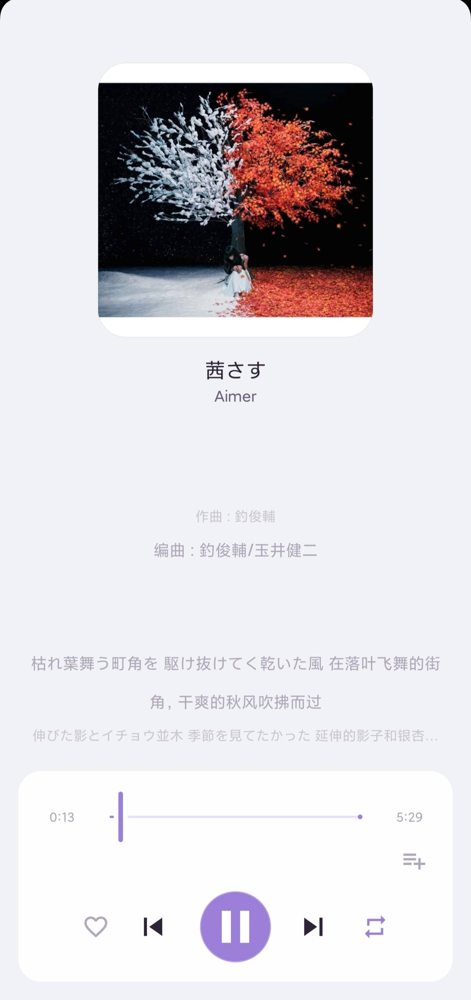
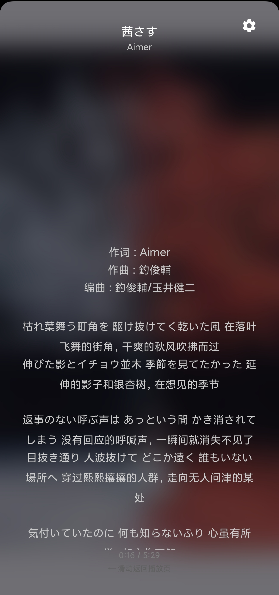
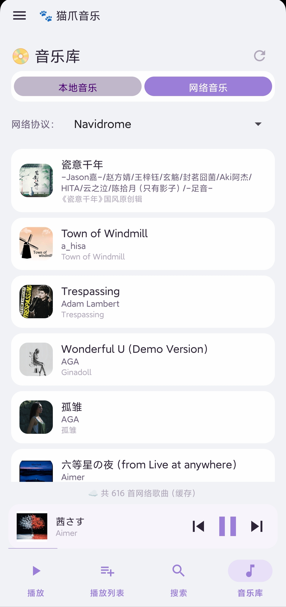
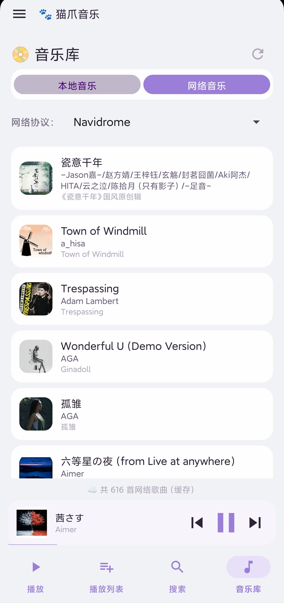

# 🐾 猫爪音乐 (CatClaw Music)

> 萌系 Android 音乐播放器，.NET 10 + C# 原生开发。支持本地音乐、Navidrome/Subsonic 网络音乐、WebDAV 远程文件、SMB/CIFS 协议、桌面悬浮歌词（可拖拽/锁定/双行KTV）、逐字歌词渐变高亮、全屏歌词体验、音频频谱可视化、睡眠定时、通知栏媒体控制 + MediaSession、播放状态自动保存与恢复、MediaStore 极速封面加载、动态流光背景、封面取色主题、AI 对话式搜索。

<div align="center">


-orange)


</div>

<br />

<div align="center">

<h2 align="center">🐾 加入猫爪音乐交流群</h2>

<a href="https://qm.qq.com/q/Fhu3IEzqa4" target="_blank">

</a>

<br />

**点击上方按钮加入群聊 ₍˄·͈༝·͈˄*₎◞ ̑̑**

</div>

<br />

<hr />

## 📱 应用截图

<details>
<summary>🖱️ 点击展开查看应用截图</summary>

<br />

<div align="center">

### 播放页面



### 歌词页面



### 播放列表



### 音乐库



</div>

</details>

***

## 🏗️ 项目架构

```
CatClawMusic/
├── CatClawMusic.Core/          # 核心层（接口 + 模型 + 服务）
│   ├── Interfaces/             # 14 个服务接口
│   ├── Models/                 # 12 个数据模型 + 2 枚举
│   └── Services/               # PlayQueue / LyricsService / TagReader / MusicUtility / PluginManager
│
├── CatClawMusic.Data/          # 数据层（数据库 + 网络服务）
│   ├── MusicDatabase.cs        # SQLite（9 表 + 索引 + WAL）
│   ├── SubsonicService.cs      # Navidrome/OpenSubsonic API
│   ├── WebDavService.cs        # WebDAV 协议
│   ├── SmbService.cs           # SMB/CIFS 协议
│   ├── MusicScanner.cs         # 统一渐进式批量入库
│   ├── MusicLibraryService.cs  # 音乐库服务实现
│   └── NetworkMusicService.cs  # 网络音乐工厂
│
├── CatClawMusic.Native/        # 原生 C++ 层（FFT/标签/颜色/频谱）
│   └── src/                    # catclaw_native.so 源码
│
└── CatClawMusic.UI/            # UI 层（Android 原生界面）
    ├── MainActivity.cs         # ViewPager2 + BottomNav + 侧滑面板 + 迷你播放器
    ├── Fragments/              # 18 个 Fragment
    ├── ViewModels/             # MVVM（CommunityToolkit.Mvvm 源生成器）
    ├── Helpers/                # StrokeTextView / SweepGradientView / AudioVisualizerView / GlassDialog
    ├── Services/               # 桌面歌词 / 导航 / 播放状态 / MaterialYou 取色 / AI 对话
    ├── Adapters/               # 歌曲列表 / 播放列表 适配器（MediaStore 封面优先加载）
    └── Platforms/Android/      # ExoPlayer / SAF / 主题 / MediaStoreCoverHelper / AndroidMediaScanner
```

**技术栈**：.NET 10 | C# 12 | AndroidX Media3 ExoPlayer 1.10.0 | CommunityToolkit.Mvvm 8.2.2 | TagLibSharp 2.3.0 | SQLite (sqlite-net-pcl) | SMBLibrary | Material 3 | Android Visualizer API

***

## ✨ 功能特性

### 🎵 本地音乐

| 特性 | 说明 |
|------|------|
| SAF 文件夹选择 | 系统文件管理器界面，无需 MANAGE_EXTERNAL_STORAGE |
| 多文件夹支持 | 管道分隔存储多个 SAF URI，权限过期自动检测并移除 |
| MediaStore 扫描 | Android 10+ 无需存储权限即可扫描设备音频 |
| 三路径扫描策略 | SAF Picker(优先) → MANAGE_EXTERNAL_STORAGE + MediaStore → MediaStore 只读 |
| 本地音乐设置页 | 使用 Android 媒体库开关 / 不扫描 60s 以下音频 / 自定义文件夹 / 权限管理 |
| 递归扫描 | DocumentsContract.BuildChildDocumentsUriUsingTree 递归遍历 |
| 音频格式 | .mp3 .flac .wav .ogg .opus .m4a .aac .wma .ape .dsf .dff 等 26 种 |
| Tag 读取 | TagLibSharp 解析标题/艺术家/专辑/时长/比特率/年份/音轨/流派/封面/嵌入歌词 |
| 增量式扫描 | 每 20 首一批回调入库 + 列表实时刷新，进度条动画 |
| MediaStore 极速封面 | LruCache → 磁盘缓存 → MediaStore LoadThumbnail(Q+) → TagLib/网络 |
| 封面懒加载 | 滚动到可见时加载，ConcurrentDictionary 去重 + SemaphoreSlim(4) 限流 |

### ▶️ 音频播放 (ExoPlayer)

| 特性 | 说明 |
|------|------|
| 播放引擎 | AndroidX Media3 ExoPlayer 1.10.0 |
| 播放/暂停/上下曲 | 完整控制 |
| 进度拖动 | Material Slider，松手 seek |
| 流媒体播放 | 支持 HTTP/HTTPS URL，content:// URI，file:// 本地播放 |
| Basic Auth | URL 嵌入 user:pass@host 自动提取，转为 Authorization 请求头 |
| WakeLock + WiFi Lock | 后台播放防 CPU 休眠，锁屏不断网 |
| 音频焦点 | Gain→恢复 / Loss→暂停 / LossTransient→暂停后恢复 / LossTransientCanDuck→音量降至 1/3 |
| 播放状态持久化 | 每 ~5 秒自动保存位置/模式，启动时同步恢复 |
| 音频频谱可视化 | Android Visualizer API + FFT，64 频段实时跳动 |
| 睡眠定时 | 10/20/30/45/60/90 分钟 + 自定义时间倒计时，可选播完再停 |

### 🔀 播放队列与模式

| 特性 | 说明 |
|------|------|
| 顺序播放 / 列表循环 / 单曲循环 / 随机播放 | Fisher-Yates 洗牌算法，双列表设计 |
| 播放历史栈 | Stack，支持上一曲回退 |
| 即将播放预览 | GetUpcomingSongs(N) 显示接下来 N 首 |
| O(1) 歌曲查找 | _songIdToIndex 字典 |

### 🎶 歌词系统

| 特性 | 说明 |
|------|------|
| LRC 格式解析 | 兼容多种时间戳格式，支持多时间戳行 |
| 多源歌词 | 嵌入歌词 → 同名 .lrc → Navidrome 远程歌词 → 磁盘缓存 |
| 歌词编码检测 | BOM UTF-8 → 严格 UTF-8 → GBK → GB2312 → 默认，解决中文乱码 |
| 逐字歌词渐变 | StrokeTextView Canvas ClipRect 实现像素级从左到右渐变高亮，已唱白色/未唱黑色 |
| 逐行歌词高亮 | 当前行放大 4sp + 纯白高亮，非当前行半透明黑 |
| 全屏歌词页 | 毛玻璃模糊背景（Android 12+ RenderEffect），手动滚动暂停 3 秒后恢复自动 |
| 拖拽定位 | 检测拖拽阈值(20px)，显示虚线+跳转按钮，松手 seek |
| 歌词设置 | 逐行/逐字切换 / 拖拽开关 / 字体大小 / 对齐方式(左/中/右) |
| 双语歌词 | 原文+译文同时显示，高亮行同时高亮译文 |
| 横屏全屏歌词 | 点击歌词区收起控制面板，歌词自动切换为上下居中 |

### 🖥️ 桌面悬浮歌词

| 特性 | 说明 |
|------|------|
| 悬浮窗显示 | SYSTEM_ALERT_WINDOW 权限，ApplicationOverlay(Android O+) |
| 触摸拖拽 | Y 轴拖拽，锁定模式禁止触摸 |
| 锁定模式 | 锁定位置 / 解锁，2 秒后自动隐藏锁定按钮 |
| 单行模式 | 居中跑马灯滚动 |
| 双行 KTV | 当前行左上亮色 + 下一行右下暗色 |
| 字体/颜色/粗体/透明度 | 全部可自定义，实时生效 |
| 通知栏快捷控制 | 开/关/锁定/单双行切换 |

### 💚 收藏与播放历史

| 特性 | 说明 |
|------|------|
| 收藏/取消 | 实时写入 SQLite |
| 播放历史 | 自动记录全部历史，去重计次（PlayCount 字段） |
| 通知栏收藏 | 工具通知一键收藏/取消 |

### 🔔 通知栏 / MediaSession

| 特性 | 说明 |
|------|------|
| 双通知设计 | 主通知(播放控制) + 工具通知(快捷操作) |
| MediaStyle 主通知 | 上一曲/播放暂停/下一曲 + 大尺寸专辑封面 |
| MediaSession | 蓝牙耳机/车载音响/穿戴设备控制 |
| 前台 Service | foregroundServiceType=mediaPlayback 保活 |

### 🎨 主题与配色

| 特性 | 说明 |
|------|------|
| 5 色主题 | Purple(默认) / Pink / Blue / Green / Orange |
| 深色模式 | 明亮 / 深色 / 跟随系统 三种设置 |
| 无重启主题切换 | 运行时直接变色，音频不中断 |
| 动态流光背景 | ValueAnimator 驱动 3 个色带独立相位漂移 + 呼吸 + 缩放脉冲 |
| 切歌颜色过渡 | 800ms ArgbEvaluator 平滑过渡背景色和光晕颜色 |
| 封面取色主题 | MaterialYouPalette HSV 色调映射，封面主色驱动播放页配色 |
| 封面切换动画 | 缩小到 92% + 淡出 → 500ms Overshoot 弹回 + 淡入 |
| 毛玻璃风格卡片 | CatClawCard / CatClawCardSmall / CatClawCardImage |

### ☁️ 网络协议

> **已实现**：WebDAV、Navidrome (Subsonic API)、SMB/CIFS　|　**规划中**：DLNA、FTP、NFS

| 协议 | 特性 |
|------|------|
| Navidrome | 增量式扫描 / 封面图 / 歌词三级回退 / 收藏同步 / 流媒体 / 搜索 / Token 认证 |
| WebDAV | PROPFIND / 递归扫描 / GET 流播放 / 元数据提取 / Basic 认证 / SSL 跳过验证 |
| SMB/CIFS | 共享目录浏览 / 递归扫描 / 域认证 / NTLM 认证 / 流播放 |

### 🔍 探索（AI 对话式搜索）

| 特性 | 说明 |
|------|------|
| 对话式布局 | 用户发送消息后以卡片消息回复，支持多种消息类型 |
| AI 对话 | 接入 OpenAI 兼容 API，支持多供应商（DeepSeek/魔搭社区/智谱AI/Moonshot/通义千问/讯飞星火/llama.cpp） |
| 简单指令 | 无需 AI 即可使用：播放、暂停、上一曲、下一曲、创建歌单 |
| 向导式添加模型 | 4 步骤：选择服务商 → 输入 key → 选择模型 → 完成/启用 |

### 🔌 插件体系

| 接口 | 说明 |
|------|------|
| IPlugin | 插件基类：Name / Version / Author / Capabilities |
| ILyricsProviderPlugin | 歌词提供者：GetLyricsAsync |
| ICoverProviderPlugin | 封面提供者：GetCoverAsync |
| IProtocolProviderPlugin | 协议提供者：ListFilesAsync / OpenReadAsync |
| IAudioEnhancerPlugin | 音频增强器：ProcessSamples |
| IMenuContributorPlugin | 菜单贡献者：GetMenuItems |

**已发布插件**：[猫爪标签 (CatClawTag)](https://github.com/kankejiang/CatClawTagPlugin) — 歌词/封面多源搜索、匹配元数据、标签读写

***

## 🗄️ 数据库结构

**SQLite + WAL 模式**，9 张表：Songs / Artists / Albums / Playlists / PlaylistSongs / Favorites / PlayHistory / Lyrics / CachedSongs / ConnectionProfiles

***

## 📜 开源协议

MIT License
