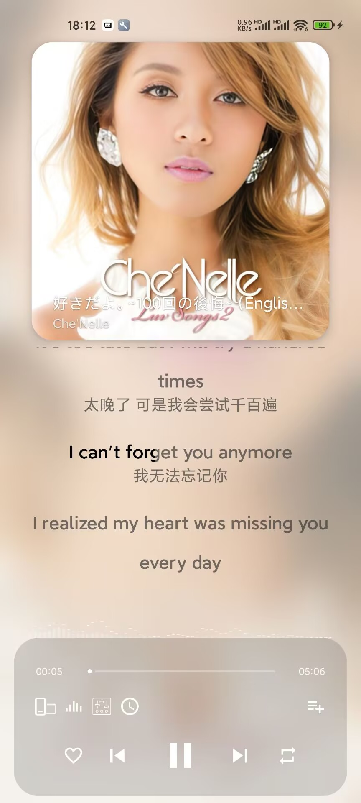
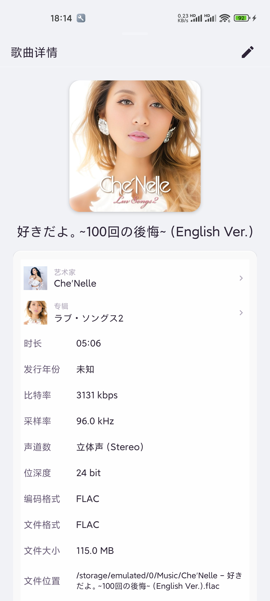

# 🐾 猫爪音乐 (CatClaw Music)

> 萌系 Android 音乐播放器，.NET 10 + C# 13 原生开发（MAUI）。支持本地音乐、Navidrome/Subsonic 网络音乐、WebDAV 远程文件、SMB/CIFS 协议、桌面悬浮歌词（可拖拽/锁定/双行KTV）、逐字歌词渐变高亮、全屏歌词体验、音频频谱可视化、睡眠定时、通知栏5按钮媒体控制（HyperOS/MIUI适配）、权限统一管理、自定义启动页（API/本地图片）、播放状态自动保存与恢复、MediaStore 极速封面加载、动态流光背景、封面取色主题、AI 对话式搜索、音效均衡器（12种预设）、备份恢复、艺术家元数据爬虫、插件体系。🐱

<div align="center">


-orange)


</div>

<br />

<div align="center">

## 🐾 加入猫爪音乐交流群

[](https://qm.qq.com/q/Fhu3IEzqa4)

**点击上方按钮加入群聊 ₍˄·͈༝·͈˄*₎◞ ̑̑**

</div>

<br />

---

## 📱 应用截图

<details>
<summary>🖱️ 点击展开查看应用截图</summary>

<br />

<div align="center">

### ▶️ 播放页面



### 🎶 歌词页面


### 💿 歌曲详情



### 📜 歌单


### ✨ 探索 - 每日推荐


### 🎤 探索 - 艺术家


### 📚 音乐库


</div>

</details>

---

## 🏗️ 项目架构

```
CatClawMusic/
├── CatClawMusic.Core/          # 核心层（接口 + 模型 + 服务）
│   ├── Interfaces/             # 15 个服务接口
│   ├── Models/                 # 14 个数据模型
│   └── Services/               # PlayQueue / LyricsService / TagReader / MusicUtility / PluginManager
│       └── AI/                 # AgentService / AgentTools / ChatModels / OpenAiCompatibleLlmClient
│
├── CatClawMusic.Data/          # 数据层（数据库 + 网络服务 + 爬虫）
│   ├── MusicDatabase.cs        # SQLite（11 表 + 索引 + WAL）
│   ├── SubsonicService.cs      # Navidrome/OpenSubsonic API
│   ├── WebDavService.cs        # WebDAV 协议
│   ├── SmbService.cs           # SMB/CIFS 协议
│   ├── MusicScanner.cs         # 统一渐进式批量入库
│   ├── MusicLibraryService.cs  # 音乐库服务实现
│   ├── NetworkMusicService.cs  # 网络音乐工厂
│   ├── BackupService.cs        # 备份恢复（ZIP打包，6 种数据类别）
│   ├── ExploreDataService.cs   # 每日推荐引擎
│   ├── NetEaseMusicScraper.cs  # 网易云音乐元数据爬虫（主爬虫）
│   ├── AiArtistScraper.cs      # AI/LLM 艺术家信息爬虫
│   ├── MultiSourcePhotoScraper.cs # QQ音乐等多源图片爬虫
│   └── IArtistMetadataScraper.cs # 爬虫接口 + ArtistSearchResult
│
└── CatClawMusic.Maui/          # UI 层（.NET MAUI 跨平台界面）
    ├── AppShell.xaml           # Shell 导航结构
    ├── Pages/                  # 30+ 个页面（ContentPage）
    │   ├── SearchPage.xaml             # 发现页（AI 对话 + 每日推荐）
    │   ├── LibraryPage.xaml            # 音乐库浏览
    │   ├── NowPlayingPage.xaml         # 播放页
    │   ├── AlbumDetailPage.xaml        # 专辑详情
    │   ├── ArtistDetailPage.xaml       # 艺术家详情
    │   ├── SettingsPage.xaml           # 设置主页
    │   ├── AiSettingsPage.xaml        # AI 设置
    │   ├── PermissionManagementPage.xaml # 权限管理
    │   ├── RemoteMusicSettingsPage.xaml # 远程音乐服务设置
    │   ├── PluginManagementPage.xaml  # 插件管理
    │   └── ...                        # 其他页面
    ├── ViewModels/             # MVVM ViewModel（CommunityToolkit.Mvvm）
    ├── Controls/               # 自定义控件（BackButton 等）
    ├── Converters/             # 值转换器
    ├── Platforms/Android/      # Android 平台特定代码
    │   ├── AudioPlayerService.Android.cs  # ExoPlayer 实现
    │   └── SafeContentScanner.cs         # SAF 扫描器（支持封面提取）
    └── Resources/              # 资源文件（样式/图片/字体）
```

**技术栈**：.NET 10 ｜ C# 13 ｜ MAUI 10.0.20 ｜ AndroidX Media3 ExoPlayer 1.10.1 ｜ CommunityToolkit.Mvvm 8.4.2 ｜ TagLibSharp 2.3.0 ｜ SQLite (sqlite-net-pcl) ｜ SMBLibrary 1.5.2 ｜ Material 3 ｜ Android Visualizer API ｜ NativeAOT (Mono AOT) ｜ Microsoft.Extensions.DI 9.0

---

## ✨ 功能特性

### 🎵 本地音乐

| 特性 | 说明 |
|------|------|
| SAF 文件夹选择 | 系统文件管理器界面，无需 MANAGE_EXTERNAL_STORAGE |
| 多文件夹支持 | 管道分隔存储多个 SAF URI，权限过期自动检测并移除 |
| MediaStore 扫描 | Android 10+ 无需存储权限即可扫描设备音频 |
| 三路径扫描策略 | SAF Picker(优先) → MANAGE_EXTERNAL_STORAGE + MediaStore → MediaStore 只读 |
| 本地音乐设置页 | 使用 Android 媒体库开关 / 不扫描 60s 以下音频 / 自定义文件夹 / 权限管理 |
| 递归扫描 | DocumentsContract.BuildChildDocumentsUriUsingTree 递归遍历 |
| 音频格式 | .mp3 .flac .wav .ogg .opus .m4a .aac .wma .ape .dsf .dff 等 26 种 |
| Tag 读取 | TagLibSharp 解析标题/艺术家/专辑/时长/比特率/年份/音轨/流派/封面/嵌入歌词 |
| 增量式扫描 | 每 20 首一批回调入库 + 列表实时刷新，进度条动画 |
| MediaStore 极速封面 | LruCache → 磁盘缓存 → MediaStore LoadThumbnail(Q+) → TagLib/网络 |
| 封面懒加载 | 滚动到可见时加载，ConcurrentDictionary 去重 + SemaphoreSlim(4) 限流 |
| **SAF 封面提取** | **扫描时直接通过 MediaMetadataRetriever 提取嵌入封面，支持 content:// URI** |

### ▶️ 音频播放 (ExoPlayer)

| 特性 | 说明 |
|------|------|
| 播放引擎 | AndroidX Media3 ExoPlayer 1.10.1 |
| 播放/暂停/上下曲 | 完整控制 |
| 进度拖动 | Material Slider，松手 seek |
| 流媒体播放 | 支持 HTTP/HTTPS URL，content:// URI，file:// 本地播放 |
| Basic Auth | URL 嵌入 user:pass@host 自动提取，转为 Authorization 请求头 |
| WakeLock + WiFi Lock | 后台播放防 CPU 休眠，锁屏不断网 |
| 音频焦点 | Gain→恢复 / Loss→暂停 / LossTransient→暂停后恢复 / LossTransientCanDuck→音量降至 1/3 |
| 播放状态持久化 | 每 ~5 秒自动保存位置/模式，启动时同步恢复 |
| 音频频谱可视化 | Android Visualizer API + FFT，64 频段实时跳动 |
| 睡眠定时 | 10/20/30/45/60/90 分钟 + 自定义时间倒计时，可选播完再停 |
| **进度条修复** | **通过 ExoPlayer IPlayerListener 准确跟踪播放状态，避免进度条卡死** |

### 🎛️ 音效系统

| 特性 | 说明 |
|------|------|
| 均衡器 | Android Equalizer API，5 频段调节 |
| 低音增强 | BassBoost，增强低频响应 |
| 环绕声 | Virtualizer，虚拟环绕立体声 |
| 混响 | PresetReverb，模拟不同声场环境 |
| 12 种预设 | 原声 / 杜比全景声 / 音乐厅 / 现场演出 / 环绕立体声 / 低音增强 / 高音增强 / 人声增强 / 电子 / 摇滚 / 流行 / 爵士 / 古典 |

### 🔀 播放队列与模式

| 特性 | 说明 |
|------|------|
| 顺序播放 / 列表循环 / 单曲循环 / 随机播放 | Fisher-Yates 洗牌算法，双列表设计 |
| 播放历史栈 | Stack，支持上一曲回退 |
| 即将播放预览 | GetUpcomingSongs(N) 显示接下来 N 首 |
| O(1) 歌曲查找 | _songIdToIndex 字典 |

### 🎶 歌词系统

| 特性 | 说明 |
|------|------|
| LRC 格式解析 | 兼容多种时间戳格式，支持多时间戳行 |
| TTML/AMLL 歌词 | W3C TTML 标准（Apple Music / Netflix），AMLL (Apple Music Lyrics) M4A 二进制扫描 |
| 多源歌词 | 嵌入歌词 → 同名 .lrc/.ttml/.xml → 插件提供者 → Navidrome 远程歌词 → 磁盘缓存 |
| SAF 歌词 | 支持 Android content:// URI 读取 SAF 文件夹中的歌词文件 |
| 歌词编码检测 | BOM UTF-8 → 严格 UTF-8 → GBK → GB2312 → 默认，解决中文乱码 |
| 逐字歌词渐变 | StrokeTextView Canvas ClipRect 实现像素级从左到右渐变高亮，已唱白色/未唱黑色 |
| 逐行歌词高亮 | 当前行放大 4sp + 纯白高亮，非当前行半透明黑 |
| 全屏歌词页 | 毛玻璃模糊背景（Android 12+ RenderEffect），手动滚动暂停 3 秒后恢复自动 |
| 拖拽定位 | 检测拖拽阈值(20px)，显示虚线+跳转按钮，松手 seek |
| 歌词设置 | 逐行/逐字切换 / 拖拽开关 / 字体大小 / 对齐方式(左/中/右) |
| 双语歌词 | 原文+译文同时显示，高亮行同时高亮译文 |
| 横屏全屏歌词 | 点击歌词区收起控制面板，歌词自动切换为上下居中 |

### 🖥️ 桌面悬浮歌词

| 特性 | 说明 |
|------|------|
| 悬浮窗显示 | SYSTEM_ALERT_WINDOW 权限，ApplicationOverlay(Android O+) |
| 触摸拖拽 | Y 轴拖拽，锁定模式禁止触摸 |
| 锁定模式 | 锁定位置 / 解锁，2 秒后自动隐藏锁定按钮 |
| 单行模式 | 居中跑马灯滚动 |
| 双行 KTV | 当前行左上亮色 + 下一行右下暗色 |
| 字体/颜色/粗体/透明度 | 全部可自定义，实时生效 |
| 通知栏快捷控制 | 开/关/锁定/单双行切换 |

### 💚 收藏与播放历史

| 特性 | 说明 |
|------|------|
| 收藏/取消 | 实时写入 SQLite |
| 播放历史 | 自动记录全部历史，去重计次（PlayCount 字段） |
| 通知栏收藏 | 工具通知一键收藏/取消 |

### 🔔 通知栏 / MediaSession

| 特性 | 说明 |
|------|------|
| HyperOS/MIUI 5按钮通知 | 收藏/上一曲/播放暂停/下一曲/桌面歌词，通过 PlaybackState.CustomAction 实现 |
| MediaStyle 主通知 | 大尺寸专辑封面 + 5个控制按钮 |
| MediaSession | 蓝牙耳机/车载音响/穿戴设备控制 |
| 前台 Service | foregroundServiceType=mediaPlayback 保活 |

### 🎨 主题与配色

| 特性 | 说明 |
|------|------|
| 5 色主题 | Purple(默认) / Pink / Blue / Green / Orange |
| 深色模式 | 明亮 / 深色 / 跟随系统 三种设置 |
| 无重启主题切换 | 运行时直接变色，音频不中断 |
| 动态流光背景 | ValueAnimator 驱动 3 个色带独立相位漂移 + 呼吸 + 缩放脉冲 |
| 切歌颜色过渡 | 800ms ArgbEvaluator 平滑过渡背景色和光晕颜色 |
| 封面取色主题 | MaterialYouPalette HSV 色调映射，封面主色驱动播放页配色 |
| 封面切换动画 | 缩小到 92% + 淡出 → 500ms Overshoot 弹回 + 淡入 |
| 毛玻璃风格卡片 | CatClawCard / CatClawCardSmall / CatClawCardImage |
| **全局导航栏隐藏** | **所有页面默认隐藏顶部导航栏，二级页面添加返回按钮** |

### ☁️ 网络协议

> **已实现**：WebDAV、Navidrome (Subsonic API)、SMB/CIFS

| 协议 | 特性 |
|------|------|
| Navidrome | 增量式扫描 / 封面图 / 歌词三级回退 / 收藏同步 / 流媒体 / 搜索 / Token 认证 |
| WebDAV | PROPFIND / 递归扫描 / GET 流播放 / 元数据提取 / Basic 认证 / SSL 跳过验证 |
| SMB/CIFS | 共享目录浏览 / 递归扫描 / 域认证 / NTLM 认证 / 流播放 |

### 📦 备份与恢复

| 特性 | 说明 |
|------|------|
| ZIP 打包 | 备份数据打包为单个 `.zip` 文件，含 JSON + 图片 |
| 6 大数据类别 | 播放列表 / 播放历史 / 收藏 / 艺术家元数据 / AI 模型配置 / 艺术家封面 |
| 进度报告 | 实时进度百分比 + 状态消息 |
| 分类恢复 | 可单独恢复某一类数据，无需全部恢复 |
| 跨设备匹配 | 播放历史/收藏备份包含歌曲标题和艺术家名，跨设备自动匹配 |
| 备份文件管理 | 自动列出所有备份文件，支持旧版 `.json` 格式兼容 |

### 🎤 艺术家元数据爬虫

| 来源 | 说明 |
|------|------|
| 网易云音乐 | 主爬虫：艺术家简介、性别、地区、头像 |
| AI/LLM | 通过 AI 模型补充艺术家信息 |
| QQ 音乐 | 多源图片爬虫，搜索高分辨率艺术家照片 |
| 爬虫链 | 优先级链式调用：网易云 → AI → QQ 音乐 |

### 📊 每日推荐

| 特性 | 说明 |
|------|------|
| 推荐引擎 | ExploreDataService 本地智能推荐 |
| 多维度 | 基于播放历史、收藏、时间等多维数据分析 |
| 首页展示 | HomeFragment 中展示推荐内容卡片 |

### 🔍 探索（AI 对话式搜索）

| 特性 | 说明 |
|------|------|
| 对话式布局 | 用户发送消息后以卡片消息回复，支持多种消息类型 |
| AI 对话 | 接入 OpenAI 兼容 API，8 个内置供应商（DeepSeek / 魔搭社区 / llama.cpp / 智谱AI / Moonshot / 通义千问 / 讯飞星火 / 自定义兼容） |
| 18 个 Agent 工具 | 搜索音乐 / 创建歌单 / 添加歌曲到歌单 / 移除歌曲 / 列出歌单 / 获取歌单歌曲 / 删除歌单 / 播放歌曲 / 网络搜索 / 控制播放 / 当前歌曲信息 / 获取播放队列 / 收藏切换 / 获取收藏 / 最近播放 / 播放统计 / 添加到队列 / 清空队列 |
| 猫娘人格 | 内置 "Yuki" 猫娘角色系统，可扩展自定义 Agent 人格 |
| 简单指令 | 无需 AI 即可使用：播放、暂停、上一曲、下一曲、创建歌单 |
| 多配置管理 | 支持多个 AI 模型配置，可独立启用/禁用 |
| 故障转移 | 主模型失败时自动回退到启用 Fallback 的备选模型 |
| 向导式添加 | 4 步骤：选择服务商 → 输入 key → 选择模型 → 完成/启用 |
| 流式文本 | LLM 客户端支持 GZip/Deflate 自动解压 |
| **设置页完善** | **AI 设置/权限管理/远程音乐服务/插件管理 4 个占位页已全部转正为真实功能页** |

### 🔌 插件体系

| 接口 | 说明 |
|------|------|
| IPlugin | 插件基类：Name / Version / Author / Capabilities |
| ILyricsProviderPlugin | 歌词提供者：GetLyricsAsync |
| ICoverProviderPlugin | 封面提供者：GetCoverAsync |
| IProtocolProviderPlugin | 协议提供者：ListFilesAsync / OpenReadAsync |
| IAudioEnhancerPlugin | 音频增强器：ProcessSamples |
| IMenuContributorPlugin | 菜单贡献者：GetMenuItems |

| 管理功能 | 说明 |
|------|------|
| 本地安装 | 从 .dll / .ccp 文件安装插件 |
| GitHub 安装 | 从 GitHub Release 下载并安装 |
| 启用/禁用 | 运行时开关，失败自动禁用 |
| 卸载 | 一键卸载并清理 |
| 自动恢复 | 启动时自动加载已安装插件列表 |
| 反射适配 | 兼容不同版本宿主程序集，自动反射代理适配 |
| 子插件 | 单个插件包可包含多个能力提供者 |
| 广播联动 | 插件可发送广播触发音乐库全量重新扫描 |

### 🔐 权限管理

| 特性 | 说明 |
|------|------|
| 统一权限管理页 | 设置页一键进入，6项权限状态一目了然 |
| 通知权限 | 播放控制通知、锁屏控件，Android 13+ 适配 |
| 悬浮窗权限 | 桌面歌词悬浮显示，多厂商适配（MIUI/ColorOS 等） |
| 麦克风 | 音频频谱可视化 |
| 照片和视频 | 读取专辑封面、艺术家图片，Android 13+ 细粒度权限 |
| 音乐和音频 | 扫描和播放本地音乐文件 |
| 管理外部存储 | 备份恢复、全盘扫描音乐，Android 11+ 适配 |
| 一键跳转系统设置 | 未授权权限点击直达对应系统设置页 |

### 🖼️ 启动页

| 特性 | 说明 |
|------|------|
| 自定义 API | 可配置任意图片 API 作为启动页背景 |
| 自定义本地图片 | 从相册选择图片作为启动页背景 |
| 缓存机制 | 网络图片自动缓存，下次启动秒开 |
| 预览功能 | 设置页内实时预览当前启动页效果 |
| 初始化等待 | 启动页等待数据库初始化 + 播放状态恢复完成后才跳转 |

---

## 📝 更新日志

### 🐾 v1.6.4 (2026-07-01)

#### 🐛 问题修复
- **修复封面不显示**：SAF 扫描的歌曲 FilePath 是 content:// URI，原逻辑跳过导致封面无法提取。现在扫描时通过 MediaMetadataRetriever 直接提取嵌入封面并缓存
- **修复进度条不动**：通过 ExoPlayer IPlayerListener 准确跟踪播放状态（OnPlaybackStateChanged/OnIsPlayingChanged），避免依赖 .NET 绑定的 IsPlaying 属性；进度定时器改为每 500ms 始终更新，不再依赖 IsPlaying
- **修复 MAUI 构建错误**：修复多处 Android 平台特定代码的命名冲突（File/Uri/MediaMetadataRetriever）

#### ✨ 新功能
- **设置页完善**：AI 设置/权限管理/远程音乐服务/插件管理 4 个占位页全部转正为真实功能页
  - AI 设置页：支持 8 个提供商配置、测试连通性、保存/重置
  - 权限管理页：4 类权限状态展示、一键去授权、打开系统设置
  - 远程音乐服务页：连接列表 CRUD、测试连通性、缓存统计
  - 插件管理页：插件列表、启用切换、分类展示
- **全局导航优化**：隐藏所有页面顶部导航栏，二级页面添加返回按钮
- **封面提取优化**：SafeContentScanner 扫描时直接提取嵌入封面，避免后续重复提取

#### 🔧 技术改进
- 项目结构从 CatClawMusic.UI (Xamarin) 迁移到 CatClawMusic.Maui (MAUI)
- 使用 CommunityToolkit.Mvvm 实现 MVVM 模式
- 添加 BackButton 公共控件，批量注入到 25 个二级页面

---

## 🗄️ 数据库结构

**SQLite + WAL 模式**，11 张表：Songs / Artists / Albums / SongArtists / Playlists / PlaylistSongs / Favorites / PlayHistory / Lyrics / CachedSongs / ConnectionProfiles

> 支持多艺术家（SongArtist 多对多关联表），数据库版本 v5 迁移系统，后台自动修复专辑关联、拆分合并艺术家。

---

## 📜 开源协议

MIT License 🐾
