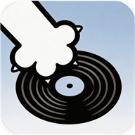

<div align="center">



# 🐾 猫爪音乐 (CatClaw Music)

**萌系跨平台本地音乐播放器 · Android & Windows**

[](https://github.com/kankejiang/CatClawMusic/releases)


-orange)


[下载安装](https://github.com/kankejiang/CatClawMusic/releases) ｜ [插件生态](#-插件生态) ｜ [问题反馈](https://github.com/kankejiang/CatClawMusic/issues) ｜ [QQ 交流群](https://qm.qq.com/q/Fhu3IEzqa4)

</div>

猫爪音乐（CatClaw Music）是一个开源的萌系跨平台本地音乐播放器，基于 .NET MAUI 原生开发（Android + Windows），为本地曲库、远程私有云曲库与在线音源插件提供一体化的播放、歌词与音效体验。无论你有的是本地 FLAC 收藏、NAS 上的无损曲库，还是想接入在线音源，猫爪音乐都能把它们装进同一个漂亮的播放器里。

## ✨ 主要功能

1. 💯 免费 & 开源（MIT），无广告、无追踪。
2. 🎧 ExoPlayer 播放引擎 + FFmpeg 软解兜底，FLAC / APE / DSD 等 26 种音频格式全支持。
3. 🎤 逐字 KTV 歌词：Canvas 像素级渐变高亮，TTML / AMLL / LRC 多格式兼容，多源三级回退。
4. 🖥️ 桌面歌词：Android 悬浮窗拖拽锁定（单行跑马灯 / 双行 KTV）；Windows 置顶歌词窗（Win2D 像素级透明、黑度可调、位置记忆）。
5. 🤖 AI 对话式搜索：内置 Agent 与 18 个工具，10 家 LLM 供应商一键配置，猫娘人格陪伴。
6. 🌐 Navidrome / WebDAV / SMB 三种远程协议，增量扫描 + 流媒体播放，私有云曲库即开即听。
7. 🎚️ 音效系统：5 频段均衡器 + 低音增强 + 环绕声 + 混响，12 种预设一键切换。
8. 🧩 插件生态：「宿主空壳，插件自治」，音源 / 歌词 / 封面等能力由独立插件提供，GitHub Release 一键安装。
9. 🎨 动态主题：封面取色 + 流光背景 + 5 色主题无重启切换，深色 / 浅色 / 跟随系统。
10. 💾 备份恢复：6 类数据 ZIP 打包，跨设备歌曲智能匹配。

## 📥 下载安装

### Windows 安装包

前往 [Releases](https://github.com/kankejiang/CatClawMusic/releases) 下载最新的 `Setup.exe` 安装包，双击安装即可。

> [!NOTE]
> 系统要求 Windows 10 17763 及以上版本。

### Android APK

前往 [Releases](https://github.com/kankejiang/CatClawMusic/releases) 下载最新的 `.apk` 安装包安装。

> [!NOTE]
> 系统要求 Android 12（API 31）及以上版本。

### 从源码构建

需要安装 [.NET 11 SDK](https://dotnet.microsoft.com/download)（版本以仓库根目录 `global.json` 为准）与 Android 工作负载。

```bash
git clone https://github.com/kankejiang/CatClawMusic.git
cd CatClawMusic
dotnet workload install android

# Android
dotnet build CatClawMusic.Maui -f net11.0-android -c Release

# Windows
dotnet build CatClawMusic.Maui -f net11.0-windows10.0.19041.0 -c Release
```

也可以使用仓库自带脚本一键出包：`build-win-release.ps1`（Windows 发布包）、`build-x64.ps1`、`build-release.ps1`（双平台 + 安装包）。

## 🎵 支持的音频格式

| 类别 | 格式 |
|------|------|
| 无损 | FLAC · APE · WAV · AIFF · ALAC · TAK · TTA · WavPack |
| 高解析 | DSD (DSF / DFF) · DXD |
| 有损 | MP3 · AAC · M4A · OGG · Opus · WMA · Musepack |

共 26 种，由 ExoPlayer 原生解码 + FFmpeg 软解兜底双通道支持。

## 🌐 支持的远程协议

将猫爪音乐连接到你的私有云曲库。

| 协议 | 能力 |
|------|------|
| **Navidrome** | 扫描 · 封面 · 歌词 · 收藏同步 · 流媒体 · Token 认证 |
| **WebDAV** | PROPFIND · 递归扫描 · GET 流播放 · Basic 认证 · SSL 跳过 |
| **SMB / CIFS** | 目录浏览 · 递归扫描 · 域 / NTLM 认证 · 流播放 |

## 🤖 AI 模型供应商

内置 10 家供应商，全部走 OpenAI 兼容协议，支持自定义接入。

| 供应商 | 说明 |
|------|------|
| **DeepSeek** | 官方 API，V4 系列预置 |
| **魔搭社区 ModelScope** | 免费推理，Qwen / DeepSeek 系列预置 |
| **智谱 AI** | GLM 系列预置 |
| **Moonshot (Kimi)** | Kimi K3 系列预置 |
| **通义千问** | Qwen 系列预置 |
| **讯飞星火** | Spark 系列预置 |
| **NVIDIA NIM** | Nemotron / Llama / Phi 等开源模型 |
| **llama.cpp** | 本地部署，离线可用 |
| **OpenCode Go** | 聚合免费模型 |
| **自定义** | 任意 OpenAI 兼容端点 |

## 🧩 插件生态

猫爪音乐采用「宿主空壳，插件自治」架构：客户端不内置任何在线音源，音源、歌词、封面、协议、音频增强等能力均由独立插件（`.ccp` / `.dll`）提供。

| 插件 | 说明 | 仓库 |
|------|------|------|
| 网易云音乐音源 | 在线搜索 · 试听播放 · 歌词 · 内置入口页 | [CatClawMusic.Plugins.Netease](https://github.com/kankejiang/CatClawMusic.Plugins.Netease) |

**安装方式**：设置 → 插件管理 → 安装，选择本地 `.ccp` 文件；或直接添加 GitHub Release 源在线安装（自动检查与宿主的版本范围兼容性）。

## 🛠️ 开发

欢迎任何 Issues / Pull Requests！新功能的添加请先通过 Issue 讨论。

猫爪音乐基于 .NET MAUI 原生开发，Android 端使用 ExoPlayer / ViewPager2 原生组件，Windows 端使用 Win2D / WinUIEx / 自研 Vitrum 毛玻璃库。

```bash
git clone https://github.com/kankejiang/CatClawMusic.git
cd CatClawMusic
dotnet workload install android
```

## 📂 项目结构

```
CatClawMusic/
├── CatClawMusic.Core/         # 核心层：接口、模型、服务、AI Agent、插件管理
├── CatClawMusic.Data/         # 数据层：SQLite、Navidrome、WebDAV、SMB、爬虫
├── CatClawMusic.Maui/         # UI 层：MAUI 页面、ViewModel、Android/Windows 平台代码
├── CatClawMusic.Plugins/      # 插件实现（宿主空壳，插件自治）
└── vitrum-src/                # Vitrum 毛玻璃库（BlurHostView / BlurConsumerView）
```

**技术栈**：.NET 11 · C# 13 · MAUI · ExoPlayer 1.10 · CommunityToolkit.Mvvm · TagLibSharp · SQLite · SMBLibrary · Win2D / WinUIEx（Windows）· Vitrum（毛玻璃）

## 📜 License

MIT

---

> [!TIP]
> 如果猫爪音乐对你的日常听歌有所帮助，欢迎给项目点一个 Star ⭐，这是我们维护这个开源项目的动力 <3

*本地音乐不该被云端绑架——你的曲库、你的歌词、你的音效，都应该装在自己的设备里。*
