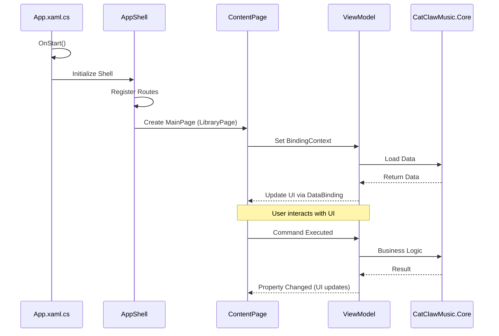
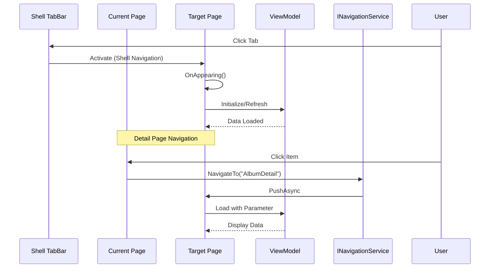
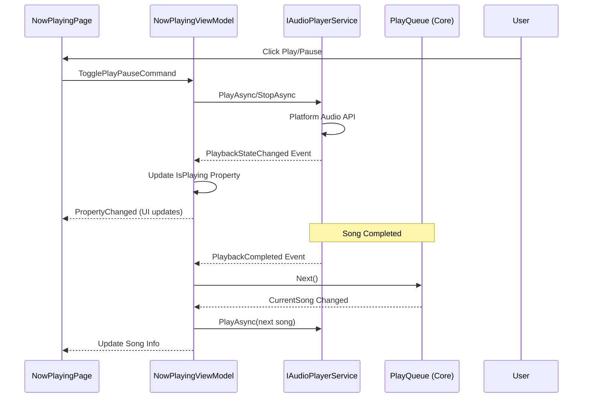
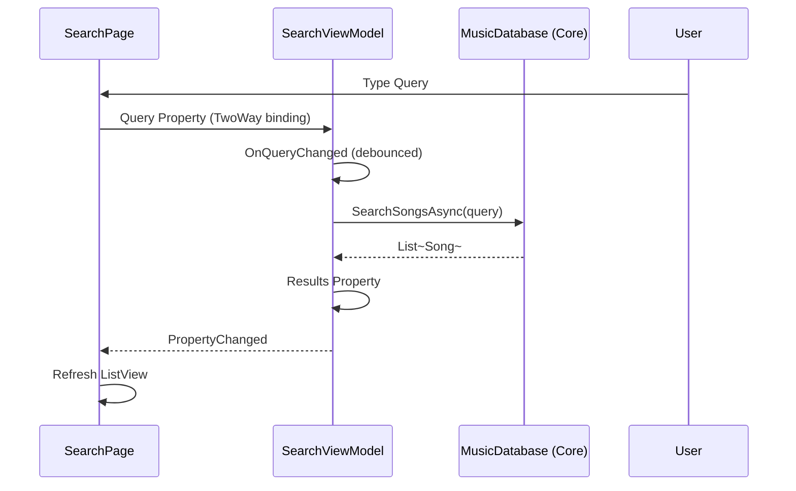
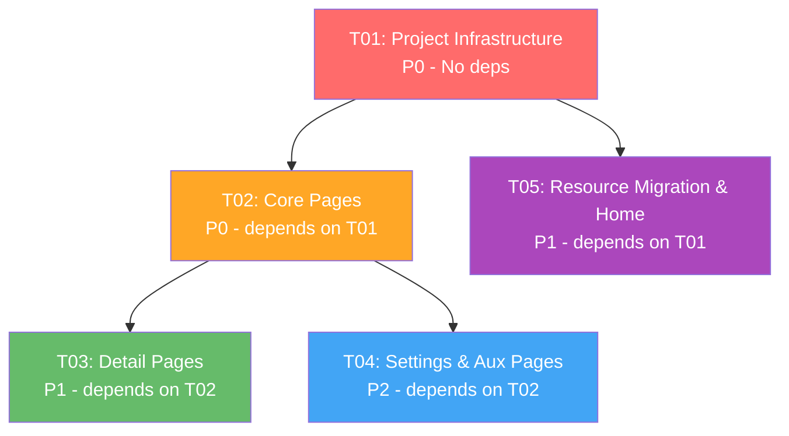

# CatClawMusic MAUI Migration - System Design & Task Decomposition

**Project**: CatClawMusic Xamarin.Android → .NET MAUI Migration  
**Version**: 1.0  
**Date**: 2024-06-30  
**Author**: Bob (Architect)

---

## Part A: System Design

### 1. Implementation Approach

#### 1.1 Core Technical Challenges

| Challenge | Description | Solution |
|----------|-------------|----------|
| **Fragment → ContentPage** | 35 Fragments need conversion to MAUI pages | Use ContentPage with Shell navigation |
| **AXML → XAML** | ~50 layout files in Android XML format | Manual conversion with MAUI XAML equivalents |
| **Resource Migration** | 625 drawable resources (icons, images) | Automated copy + namespace updates |
| **Lifecycle Mapping** | Fragment lifecycle ≠ Page lifecycle | Map to OnAppearing/OnDisappearing + events |
| **ViewPager → CollectionView** | Android ViewPager needs MAUI equivalent | Use CarouselView or CollectionView |
| **Platform Specifics** | Windows not yet supported | Use conditional compilation + interfaces |

#### 1.2 Framework and Library Selection

| Component | Technology | Justification |
|-----------|-----------|---------------|
| **MVVM Framework** | CommunityToolkit.Mvvm | Already in use, AOT-compatible |
| **Navigation** | Shell (TabBar) | Already implemented, supports deep linking |
| **UI Components** | MAUI Controls + Custom | Leverage built-in + reuse custom renders |
| **Data Binding** | ObservableProperty + RelayCommand | CommunityToolkit.Mvvm patterns |
| **Audio Playback** | Custom IAudioPlayerService | Abstraction for platform-specific audio |
| **Image Loading** | MAUI Image control | Supports local + remote images |

#### 1.3 Architecture Pattern

**MVVM (Model-View-ViewModel)** with:
- **Model**: CatClawMusic.Core (existing business logic)
- **View**: MAUI ContentPage (XAML + code-behind)
- **ViewModel**: ObservableObject with IRelayCommand

**Navigation**: Shell with TabBar for main pages, PushAsync for detail pages.

---

### 2. File List

#### 2.1 Pages (ContentPage)

```
CatClawMusic.Maui/
├── Pages/
│   ├── NowPlayingPage.xaml              # ✅ Completed
│   ├── NowPlayingPage.xaml.cs           # ✅ Completed
│   ├── LibraryPage.xaml                 # ✅ Exists (needs completion)
│   ├── LibraryPage.xaml.cs              # ✅ Exists
│   ├── SearchPage.xaml                  # ✅ Exists (needs completion)
│   ├── SearchPage.xaml.cs               # ✅ Exists
│   ├── SettingsPage.xaml                # ✅ Exists (needs completion)
│   ├── SettingsPage.xaml.cs             # ✅ Exists
│   ├── HomePage.xaml                    # ❌ To create (P1)
│   ├── HomePage.xaml.cs
│   ├── AlbumDetailPage.xaml             # ❌ To create (P1)
│   ├── AlbumDetailPage.xaml.cs
│   ├── ArtistDetailPage.xaml            # ❌ To create (P1)
│   ├── ArtistDetailPage.xaml.cs
│   ├── PlaylistDetailPage.xaml          # ❌ To create (P1)
│   ├── PlaylistDetailPage.xaml.cs
│   ├── PlaylistPage.xaml                # ❌ To create (P2)
│   ├── PlaylistPage.xaml.cs
│   ├── FolderBrowserPage.xaml           # ❌ To create (P2)
│   ├── FolderBrowserPage.xaml.cs
│   ├── FullLyricsPage.xaml              # ❌ To create (P2)
│   ├── FullLyricsPage.xaml.cs
│   ├── SongDetailPage.xaml              # ❌ To create (P2)
│   ├── SongDetailPage.xaml.cs
│   ├── GeneralSettingsPage.xaml         # ❌ To create (P2)
│   ├── GeneralSettingsPage.xaml.cs
│   ├── AppearanceSettingsPage.xaml      # ❌ To create (P2)
│   ├── AppearanceSettingsPage.xaml.cs
│   ├── LocalMusicSettingsPage.xaml      # ❌ To create (P2)
│   ├── LocalMusicSettingsPage.xaml.cs
│   ├── MusicFolderSettingsPage.xaml     # ❌ To create (P2)
│   ├── MusicFolderSettingsPage.xaml.cs
│   ├── NavidromeSettingsPage.xaml       # ❌ To create (P3)
│   ├── NavidromeSettingsPage.xaml.cs
│   ├── ServerSettingsPage.xaml          # ❌ To create (P3)
│   ├── ServerSettingsPage.xaml.cs
│   ├── P2PSettingsPage.xaml             # ❌ To create (P3)
│   ├── P2PSettingsPage.xaml.cs
│   ├── WebDavSettingsPage.xaml          # ❌ To create (P3)
│   ├── WebDavSettingsPage.xaml.cs
│   ├── AiSettingsPage.xaml              # ❌ To create (P3)
│   ├── AiSettingsPage.xaml.cs
│   ├── ModelManagerPage.xaml            # ❌ To create (P3)
│   ├── ModelManagerPage.xaml.cs
│   ├── ModelEditPage.xaml               # ❌ To create (P3)
│   ├── ModelEditPage.xaml.cs
│   ├── PluginManagementPage.xaml        # ❌ To create (P3)
│   ├── PluginManagementPage.xaml.cs
│   ├── PermissionManagementPage.xaml    # ❌ To create (P3)
│   ├── PermissionManagementPage.xaml.cs
│   ├── BackupRestorePage.xaml           # ❌ To create (P3)
│   ├── BackupRestorePage.xaml.cs
│   ├── AboutPage.xaml                   # ❌ To create (P3)
│   ├── AboutPage.xaml.cs
│   ├── SplashSettingsPage.xaml          # ❌ To create (P3)
│   ├── SplashSettingsPage.xaml.cs
│   ├── DesktopLyricPage.xaml            # ❌ To create (P3, Windows-only)
│   ├── DesktopLyricPage.xaml.cs
│   ├── ArtistMatchPage.xaml             # ❌ To create (P3)
│   ├── ArtistMatchPage.xaml.cs
│   ├── ArtistMatchDetailPage.xaml       # ❌ To create (P3)
│   └── ArtistMatchDetailPage.xaml.cs
```

#### 2.2 ViewModels

```
CatClawMusic.Maui/
├── ViewModels/
│   ├── AppViewModels.cs                 # ✅ Exists (needs expansion)
│   ├── NowPlayingViewModel.cs           # (part of AppViewModels.cs)
│   ├── LibraryViewModel.cs              # (part of AppViewModels.cs)
│   ├── SearchViewModel.cs               # ❌ To create
│   ├── SettingsViewModel.cs             # ❌ To create
│   ├── HomeViewModel.cs                 # ❌ To create
│   ├── AlbumDetailViewModel.cs          # ❌ To create
│   ├── ArtistDetailViewModel.cs         # ❌ To create
│   ├── PlaylistViewModel.cs             # ❌ To create
│   ├── PlaylistDetailViewModel.cs       # ❌ To create
│   ├── SongDetailViewModel.cs           # ❌ To create
│   ├── FolderBrowserViewModel.cs        # ❌ To create
│   ├── FullLyricsViewModel.cs           # ❌ To create
│   ├── GeneralSettingsViewModel.cs      # ❌ To create
│   ├── AppearanceSettingsViewModel.cs   # ❌ To create
│   ├── LocalMusicSettingsViewModel.cs   # ❌ To create
│   ├── MusicFolderSettingsViewModel.cs  # ❌ To create
│   ├── NavidromeSettingsViewModel.cs    # ❌ To create
│   ├── ServerSettingsViewModel.cs       # ❌ To create
│   ├── P2PSettingsViewModel.cs          # ❌ To create
│   ├── WebDavSettingsViewModel.cs       # ❌ To create
│   ├── AiSettingsViewModel.cs           # ❌ To create
│   ├── ModelManagerViewModel.cs         # ❌ To create
│   ├── ModelEditViewModel.cs            # ❌ To create
│   ├── PluginManagementViewModel.cs     # ❌ To create
│   ├── PermissionManagementViewModel.cs # ❌ To create
│   ├── BackupRestoreViewModel.cs        # ❌ To create
│   ├── AboutViewModel.cs                # ❌ To create
│   ├── SplashSettingsViewModel.cs       # ❌ To create
│   ├── DesktopLyricViewModel.cs         # ❌ To create
│   ├── ArtistMatchViewModel.cs          # ❌ To create
│   └── ArtistMatchDetailViewModel.cs    # ❌ To create
```

#### 2.3 Services

```
CatClawMusic.Maui/
├── Services/
│   ├── IAudioPlayerService.cs           # ❌ To create (interface)
│   ├── AudioPlayerService.cs            # ❌ To create (Android)
│   ├── AudioPlayerService.Windows.cs    # ❌ To create (Windows, future)
│   ├── NavigationService.cs             # ❌ To create
│   ├── DialogService.cs                 # ❌ To create
│   ├── PermissionService.cs             # ❌ To create
│   └── PlatformService.cs              # ❌ To create (platform-specific)
```

#### 2.4 Resources

```
CatClawMusic.Maui/
├── Resources/
│   ├── Images/                          # ❌ Migrate from CatClawMusic.UI/Resources/drawable/
│   │   ├── ic_*.png                     # Icon files
│   │   ├── ic_*.svg                     # Vector drawables (convert from XML)
│   │   ├── bg_*.png                     # Background images
│   │   └── ...                          # (625 files total)
│   ├── Styles/
│   │   └── Styles.xaml                  # ❌ To create (app-wide styles)
│   ├── Strings/
│   │   └── AppResources.resx            # ❌ To create (localization)
│   └── Raw/
│       └── ...                          # ❌ Migrate raw resources
```

#### 2.5 App Configuration

```
CatClawMusic.Maui/
├── App.xaml                             # ✅ Exists
├── App.xaml.cs                          # ✅ Exists
├── AppShell.xaml                        # ✅ Exists (needs route registration)
├── AppShell.xaml.cs                     # ✅ Exists
├── MauiProgram.cs                       # ✅ Exists (needs service registration)
└── GlobalUsings.cs                      # ✅ Exists
```

---

### 3. Data Structures and Interfaces

```mermaid
classDiagram
    direction TB
    
    %% Core Models (from CatClawMusic.Core)
    class Song {
        +string Id
        +string Title
        +string Artist
        +string Album
        +string FilePath
        +double Duration
        +string AlbumArtUrl
        +bool IsLiked
    }
    
    class Album {
        +string Id
        +string Title
        +string Artist
        +string CoverUrl
    }
    
    class Artist {
        +string Id
        +string Name
        +string ImageUrl
    }
    
    class Playlist {
        +string Id
        +string Name
        +List~Song~ Songs
    }
    
    %% Interfaces
    class IAudioPlayerService {
        <<interface>>
        +PlayAsync(string filePath) Task
        +PauseAsync() Task
        +StopAsync() Task
        +SeekAsync(double position) Task
        +PlaybackStateChanged event
        +PlaybackCompleted event
    }
    
    class INavigationService {
        <<interface>>
        +NavigateTo(string route) Task
        +GoBack() Task
    }
    
    class IDialogService {
        <<interface>>
        +ShowAlert(string title, string message) Task
        +ShowConfirmation(string title, string message) Task~bool~
    }
    
    %% ViewModels
    class ObservableObject {
        <<base>>
        +SetProperty~T~(ref T, T) bool
    }
    
    class NowPlayingViewModel {
        +string Title
        +string Artist
        +string AlbumArtUrl
        +bool IsPlaying
        +double Progress
        +double Duration
        +ICommand TogglePlayPauseCommand
        +ICommand PlayNextCommand
        +ICommand PlayPreviousCommand
        +UpdateCurrentSong() void
    }
    
    class LibraryViewModel {
        +List~Song~ Songs
        +bool IsLoading
        +ICommand RefreshCommand
        +LoadAsync() Task
    }
    
    class SearchViewModel {
        +string Query
        +List~Song~ Results
        +ICommand SearchCommand
        +SearchAsync() Task
    }
    
    class SettingsViewModel {
        +bool IsDarkMode
        +string Theme
        +ICommand ToggleThemeCommand
    }
    
    class AlbumDetailViewModel {
        +Album Album
        +List~Song~ Songs
        +ICommand PlayAllCommand
    }
    
    class ArtistDetailViewModel {
        +Artist Artist
        +List~Album~ Albums
        +List~Song~ TopSongs
    }
    
    class PlaylistViewModel {
        +List~Playlist~ Playlists
        +ICommand CreatePlaylistCommand
    }
    
    class PlaylistDetailViewModel {
        +Playlist Playlist
        +ICommand AddSongsCommand
        +ICommand RemoveSongCommand
    }
    
    %% Pages
    class ContentPage {
        <<base>>
        +BindingContext object
        +OnAppearing() void
        +OnDisappearing() void
    }
    
    class NowPlayingPage {
        +BindingContext NowPlayingViewModel
    }
    
    class LibraryPage {
        +BindingContext LibraryViewModel
    }
    
    class SearchPage {
        +BindingContext SearchViewModel
    }
    
    class SettingsPage {
        +BindingContext SettingsViewModel
    }
    
    class AlbumDetailPage {
        +BindingContext AlbumDetailViewModel
    }
    
    class ArtistDetailPage {
        +BindingContext ArtistDetailViewModel
    }
    
    %% Relationships
    
    ObservableObject <|-- NowPlayingViewModel
    ObservableObject <|-- LibraryViewModel
    ObservableObject <|-- SearchViewModel
    ObservableObject <|-- SettingsViewModel
    ObservableObject <|-- AlbumDetailViewModel
    ObservableObject <|-- ArtistDetailViewModel
    ObservableObject <|-- PlaylistViewModel
    ObservableObject <|-- PlaylistDetailViewModel
    
    ContentPage <|-- NowPlayingPage
    ContentPage <|-- LibraryPage
    ContentPage <|-- SearchPage
    ContentPage <|-- SettingsPage
    ContentPage <|-- AlbumDetailPage
    ContentPage <|-- ArtistDetailPage
    
    NowPlayingPage --> NowPlayingViewModel : BindingContext
    LibraryPage --> LibraryViewModel : BindingContext
    SearchPage --> SearchViewModel : BindingContext
    SettingsPage --> SettingsViewModel : BindingContext
    AlbumDetailPage --> AlbumDetailViewModel : BindingContext
    ArtistDetailPage --> ArtistDetailViewModel : BindingContext
    
    NowPlayingViewModel --> IAudioPlayerService : uses
    NowPlayingViewModel --> Song : displays
    
    LibraryViewModel --> Song : displays
    SearchViewModel --> Song : searches
    
    AlbumDetailViewModel --> Album : displays
    AlbumDetailViewModel --> Song : displays
    
    ArtistDetailViewModel --> Artist : displays
    ArtistDetailViewModel --> Album : displays
    
    PlaylistViewModel --> Playlist : displays
    PlaylistDetailViewModel --> Playlist : displays
    PlaylistDetailViewModel --> Song : manages
```



---

### 4. Program Call Flow

#### 4.1 App Launch Sequence



#### 4.2 Navigation Flow (Shell)



#### 4.3 Playback Control Flow



#### 4.4 Search Flow



---

### 5. Anything UNCLEAR

#### 5.1 Assumptions Made

1. **CatClawMusic.Core is AOT-compatible**: Using partial properties instead of PropertyChanged.Fody
2. **CommunityToolkit.Mvvm is acceptable**: Already in use in the project
3. **Shell navigation is sufficient**: No need for NavigationPage (except modals)
4. **Windows support is future goal**: Platform-specific code uses `#if WINDOWS` conditionally

#### 5.2 Unclear Aspects

1. **Windows Audio Service**: Not yet implemented, need to design interface
2. **Plugin System**: How to migrate CatClawMusic plugins to MAUI
3. **Desktop Lyric Window**: Windows-only feature, how to handle in MAUI
4. **ViewPager equivalence**: Some Fragments use ViewPager, need to confirm if CarouselView is suitable
5. **Resource count**: 625 drawable files - need to confirm which are actually used

#### 5.3 Risks

1. **AXML conversion is manual**: No automated tool, high effort
2. **Fragment lifecycle differences**: May cause bugs in edge cases
3. **Windows build broken**: Blocks testing on Windows
4. **Performance**: MAUI may be slower than Xamarin.Android on some devices

---

## Part B: Task Decomposition

### 6. Required Packages

```xml
<!-- CatClawMusic.Maui.csproj -->
<ItemGroup>
    <!-- MVVM -->
    <PackageReference Include="CommunityToolkit.Mvvm" Version="8.2.2" />
    
    <!-- MAUI -->
    <PackageReference Include="Microsoft.Maui.Controls" Version="$(MauiVersion)" />
    <PackageReference Include="Microsoft.Maui.Controls.Compatibility" Version="$(MauiVersion)" />
    
    <!-- Audio (if using plugin) -->
    <!-- <PackageReference Include="Plugin.Maui.Audio" Version="1.0.0" /> -->
    
    <!-- JSON -->
    <PackageReference Include="Newtonsoft.Json" Version="13.0.3" />
    
    <!-- Dependency Injection -->
    <PackageReference Include="Microsoft.Extensions.DependencyInjection" Version="8.0.0" />
</ItemGroup>
```

---

### 7. Task List (Ordered by Dependency)

#### Task T01: Project Infrastructure & Core Services

| Attribute | Value |
|-----------|-------|
| **Task ID** | T01 |
| **Task Name** | Project Infrastructure & Core Services Setup |
| **Priority** | P0 |
| **Dependencies** | None |

**Description**:  
Set up the foundation for the MAUI project including service interfaces, dependency injection, navigation service, and complete the App configuration.

**Source Files**:
- `CatClawMusic.Maui/Services/IAudioPlayerService.cs` (create)
- `CatClawMusic.Maui/Services/NavigationService.cs` (create)
- `CatClawMusic.Maui/Services/DialogService.cs` (create)
- `CatClawMusic.Maui/Services/PermissionService.cs` (create)
- `CatClawMusic.Maui/MauiProgram.cs` (update - add DI registration)
- `CatClawMusic.Maui/AppShell.xaml` (update - add routes)
- `CatClawMusic.Maui/Resources/Styles/Styles.xaml` (create)

**Deliverables**:
1. Service interfaces and implementations
2. Dependency injection container configured
3. Shell routes registered
4. Base styles defined

---

#### Task T02: Core Pages (Library, Search, Settings)

| Attribute | Value |
|-----------|-------|
| **Task ID** | T02 |
| **Task Name** | Complete Core Pages Migration |
| **Priority** | P0 |
| **Dependencies** | T01 |

**Description**:  
Complete the migration of the three main pages (Library, Search, Settings) that are already partially implemented. This includes completing the XAML layouts and creating proper ViewModels.

**Source Files**:
- `CatClawMusic.Maui/Pages/LibraryPage.xaml` (update)
- `CatClawMusic.Maui/Pages/LibraryPage.xaml.cs` (update)
- `CatClawMusic.Maui/Pages/SearchPage.xaml` (update)
- `CatClawMusic.Maui/Pages/SearchPage.xaml.cs` (update)
- `CatClawMusic.Maui/Pages/SettingsPage.xaml` (update)
- `CatClawMusic.Maui/Pages/SettingsPage.xaml.cs` (update)
- `CatClawMusic.Maui/ViewModels/SearchViewModel.cs` (create)
- `CatClawMusic.Maui/ViewModels/SettingsViewModel.cs` (create)
- `CatClawMusic.Maui/ViewModels/LibraryViewModel.cs` (extract from AppViewModels.cs)

**Deliverables**:
1. Fully functional LibraryPage with song list
2. Fully functional SearchPage with search results
3. Fully functional SettingsPage with navigation to settings sub-pages
4. Proper data binding and commands

---

#### Task T03: Detail Pages (Album, Artist, Playlist)

| Attribute | Value |
|-----------|-------|
| **Task ID** | T03 |
| **Task Name** | Migrate Detail Pages |
| **Priority** | P1 |
| **Dependencies** | T02 |

**Description**:  
Create the detail pages for Album, Artist, and Playlist. These pages show detailed information and allow user interactions like play, add to playlist, etc.

**Source Files**:
- `CatClawMusic.Maui/Pages/AlbumDetailPage.xaml` (create)
- `CatClawMusic.Maui/Pages/AlbumDetailPage.xaml.cs` (create)
- `CatClawMusic.Maui/Pages/ArtistDetailPage.xaml` (create)
- `CatClawMusic.Maui/Pages/ArtistDetailPage.xaml.cs` (create)
- `CatClawMusic.Maui/Pages/PlaylistDetailPage.xaml` (create)
- `CatClawMusic.Maui/Pages/PlaylistDetailPage.xaml.cs` (create)
- `CatClawMusic.Maui/Pages/PlaylistPage.xaml` (create)
- `CatClawMusic.Maui/Pages/PlaylistPage.xaml.cs` (create)
- `CatClawMusic.Maui/ViewModels/AlbumDetailViewModel.cs` (create)
- `CatClawMusic.Maui/ViewModels/ArtistDetailViewModel.cs` (create)
- `CatClawMusic.Maui/ViewModels/PlaylistViewModel.cs` (create)
- `CatClawMusic.Maui/ViewModels/PlaylistDetailViewModel.cs` (create)

**Deliverables**:
1. AlbumDetailPage showing album info and songs
2. ArtistDetailPage showing artist info, albums, and top songs
3. PlaylistPage showing list of playlists
4. PlaylistDetailPage showing playlist songs and management

---

#### Task T04: Settings Pages & Auxiliary Pages

| Attribute | Value |
|-----------|-------|
| **Task ID** | T04 |
| **Task Name** | Migrate Settings and Auxiliary Pages |
| **Priority** | P2 |
| **Dependencies** | T02 |

**Description**:  
Migrate all settings sub-pages and auxiliary pages like About, BackupRestore, FolderBrowser, etc.

**Source Files**:
- `CatClawMusic.Maui/Pages/GeneralSettingsPage.xaml` (create)
- `CatClawMusic.Maui/Pages/GeneralSettingsPage.xaml.cs` (create)
- `CatClawMusic.Maui/Pages/AppearanceSettingsPage.xaml` (create)
- `CatClawMusic.Maui/Pages/AppearanceSettingsPage.xaml.cs` (create)
- `CatClawMusic.Maui/Pages/LocalMusicSettingsPage.xaml` (create)
- `CatClawMusic.Maui/Pages/LocalMusicSettingsPage.xaml.cs` (create)
- `CatClawMusic.Maui/Pages/MusicFolderSettingsPage.xaml` (create)
- `CatClawMusic.Maui/Pages/MusicFolderSettingsPage.xaml.cs` (create)
- `CatClawMusic.Maui/Pages/BackupRestorePage.xaml` (create)
- `CatClawMusic.Maui/Pages/BackupRestorePage.xaml.cs` (create)
- `CatClawMusic.Maui/Pages/AboutPage.xaml` (create)
- `CatClawMusic.Maui/Pages/AboutPage.xaml.cs` (create)
- `CatClawMusic.Maui/Pages/FolderBrowserPage.xaml` (create)
- `CatClawMusic.Maui/Pages/FolderBrowserPage.xaml.cs` (create)
- `CatClawMusic.Maui/Pages/SongDetailPage.xaml` (create)
- `CatClawMusic.Maui/Pages/SongDetailPage.xaml.cs` (create)
- `CatClawMusic.Maui/Pages/FullLyricsPage.xaml` (create)
- `CatClawMusic.Maui/Pages/FullLyricsPage.xaml.cs` (create)
- `CatClawMusic.Maui/ViewModels/GeneralSettingsViewModel.cs` (create)
- `CatClawMusic.Maui/ViewModels/AppearanceSettingsViewModel.cs` (create)
- `CatClawMusic.Maui/ViewModels/LocalMusicSettingsViewModel.cs` (create)
- `CatClawMusic.Maui/ViewModels/MusicFolderSettingsViewModel.cs` (create)
- `CatClawMusic.Maui/ViewModels/BackupRestoreViewModel.cs` (create)
- `CatClawMusic.Maui/ViewModels/AboutViewModel.cs` (create)
- `CatClawMusic.Maui/ViewModels/FolderBrowserViewModel.cs` (create)
- `CatClawMusic.Maui/ViewModels/SongDetailViewModel.cs` (create)
- `CatClawMusic.Maui/ViewModels/FullLyricsViewModel.cs` (create)

**Deliverables**:
1. All settings sub-pages functional
2. Auxiliary pages (About, Backup, FolderBrowser, etc.)
3. Song detail and full lyrics pages

---

#### Task T05: Resource Migration & Home Page

| Attribute | Value |
|-----------|-------|
| **Task ID** | T05 |
| **Task Name** | Resource Migration & Home Page |
| **Priority** | P1 |
| **Dependencies** | T01 |

**Description**:  
Migrate all icon resources from Xamarin project to MAUI project. Also create the Home page which serves as the main dashboard. This task can be done in parallel with T02-T04.

**Source Files**:
- `CatClawMusic.Maui/Resources/Images/*` (migrate from CatClawMusic.UI/Resources/drawable/)
- `CatClawMusic.Maui/Pages/HomePage.xaml` (create)
- `CatClawMusic.Maui/Pages/HomePage.xaml.cs` (create)
- `CatClawMusic.Maui/ViewModels/HomeViewModel.cs` (create)
- `CatClawMusic.Maui/Resources/Styles/Styles.xaml` (update with theme resources)

**Deliverables**:
1. All 625 drawable resources migrated and optimized
2. HomePage created with dashboard UI
3. Resource dictionaries for icons and images
4. Theme support (dark/light mode)

---

### 8. Shared Knowledge

#### 8.1 Coding Standards

1. **Naming Convention**:
   - Pages: `{Name}Page.xaml` + `{Name}Page.xaml.cs`
   - ViewModels: `{Name}ViewModel.cs`
   - Services: `I{Name}Service.cs` + `{Name}Service.cs`

2. **MVVM Pattern**:
   - Use `CommunityToolkit.Mvvm` attributes (`[ObservableProperty]`, `[RelayCommand]`)
   - Use partial properties for AOT compatibility
   - Commands in ViewModel, events in code-behind (if necessary)

3. **Navigation**:
   - Use Shell routes for main navigation
   - Use `Navigation.PushAsync()` for detail pages
   - Pass parameters via query properties or navigation parameters

#### 8.2 Lifecycle Mapping (Fragment → Page)

| Fragment Lifecycle | MAUI Page Equivalent |
|-------------------|---------------------|
| `OnCreateView()` | Constructor + `OnAppearing()` |
| `OnViewCreated()` | `OnAppearing()` |
| `OnResume()` | `OnAppearing()` |
| `OnPause()` | `OnDisappearing()` |
| `OnDestroyView()` | `OnDisappearing()` + cleanup |
| `OnActivityCreated()` | Page constructor |

#### 8.3 Platform-Specific Code

```csharp
// Use conditional compilation
#if ANDROID
// Android-specific code
#elif WINDOWS
// Windows-specific code
#endif

// Or use partial classes
public partial class AudioPlayerService
{
    public partial Task PlayAsync(string filePath);
}

// In AudioPlayerService.Android.cs
public partial Task PlayAsync(string filePath) { /* Android implementation */ }

// In AudioPlayerService.Windows.cs
public partial Task PlayAsync(string filePath) { /* Windows implementation */ }
```

#### 8.4 Common Pitfalls

1. **Binding Context**: Always set `BindingContext` in constructor or `OnAppearing()`, not in XAML (for complex scenarios)
2. **Collection Binding**: Use `ObservableCollection<T>` for lists that change
3. **Async Commands**: Use `AsyncRelayCommand` for async operations
4. **Resource Paths**: Use `//Images/icon.png` for MAUI resources (not `Resources/drawable/`)

---

### 9. Task Dependency Graph



---

## Appendix A: Migration Priority Matrix

| Page/Feature | Priority | Reason |
|-------------|----------|--------|
| NowPlayingPage | ✅ Done | Core playback functionality |
| LibraryPage | P0 | Main music library access |
| SearchPage | P0 | Essential for finding music |
| SettingsPage | P0 | App configuration access |
| HomePage | P1 | Dashboard, nice to have |
| AlbumDetailPage | P1 | Core navigation flow |
| ArtistDetailPage | P1 | Core navigation flow |
| PlaylistDetailPage | P1 | Playlist management |
| PlaylistPage | P2 | Playlist list view |
| Settings sub-pages | P2 | Configuration options |
| Auxiliary pages | P3 | Secondary features |

---

## Appendix B: AXML to XAML Mapping Guide

### B.1 Common Controls

| Android (AXML) | MAUI (XAML) | Notes |
|----------------|-------------|-------|
| `LinearLayout` | `VerticalStackLayout` / `HorizontalStackLayout` | Use `Spacing` for margins |
| `RelativeLayout` | `Grid` / `AbsoluteLayout` | `Grid` is more common |
| `FrameLayout` | `Grid` / `Border` | Use `Grid` for overlap |
| `TextView` | `Label` | Use `Text` property |
| `EditText` | `Entry` / `Editor` | `Entry` for single-line |
| `Button` | `Button` | Similar, but use `Command` |
| `ImageView` | `Image` | Use `Source` property |
| `RecyclerView` | `CollectionView` | Use `ItemsSource` |
| `ViewPager` | `CarouselView` | For swipe pages |
| `ScrollView` | `ScrollView` | Similar |
| `CardView` | `Frame` / `Border` | Use `CornerRadius` |

### B.2 Layout Attributes

| Android | MAUI | Example |
|---------|------|---------|
| `android:layout_width` | `WidthRequest` | `WidthRequest="100"` |
| `android:layout_height` | `HeightRequest` | `HeightRequest="100"` |
| `android:layout_margin` | `Margin` | `Margin="10"` |
| `android:padding` | `Padding` | `Padding="10"` |
| `android:gravity` | `HorizontalOptions` / `VerticalOptions` | `HorizontalOptions="Center"` |
| `android:layout_weight` | `Grid` `ColumnDefinitions` / `RowDefinitions` | `Grid.ColumnDefinitions="*,Auto,*"` |
| `android:orientation` | `Orientation` (StackLayout) | `Orientation="Vertical"` |

---

## Appendix C: Effort Estimation

| Task | Pages | ViewModels | Est. Days | Notes |
|------|-------|------------|-----------|-------|
| T01 | 0 | 0 | 2 | Infrastructure setup |
| T02 | 3 | 3 | 5 | Complete existing pages |
| T03 | 4 | 4 | 7 | Detail pages |
| T04 | 10 | 10 | 10 | Settings + auxiliary |
| T05 | 1 | 1 | 3 | Resources + Home |
| **Total** | **18** | **18** | **27** | **~5-6 weeks** |

---

**End of Document**
